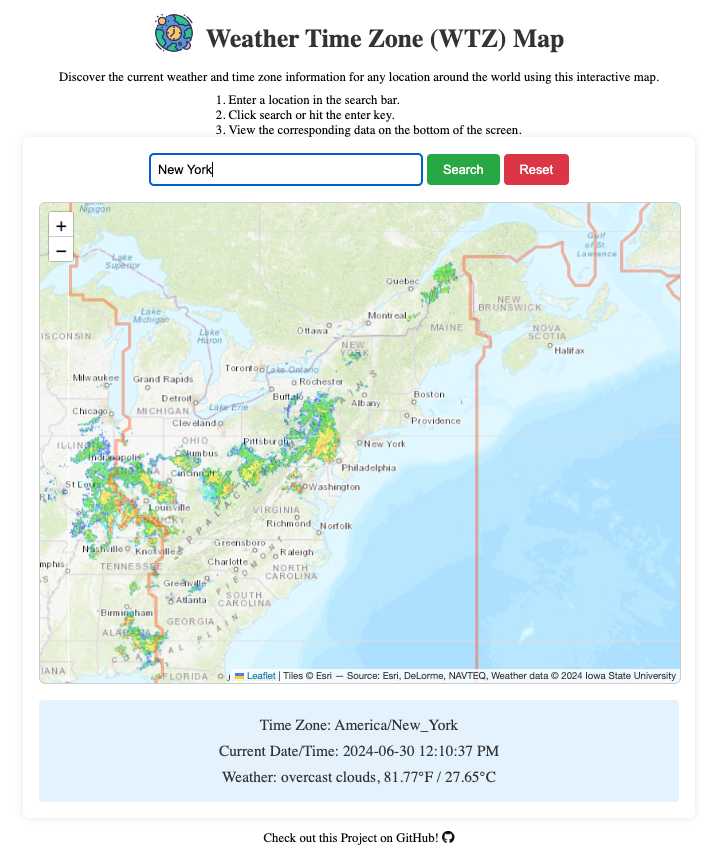

<!-- Begin README -->

<div align="center">
    <a href="https://github.com/scottgriv/WTZ-Map" target="_blank">
        
    </a>
</div>
<br>
<p align="center">
    <a href="https://nuxt.com/"></a>
    <br>
    <a href="https://github.com/scottgriv"></a>
    <a href="mailto:scott.grivner@gmail.com"></a>
    <a href="https://www.buymeacoffee.com/scottgriv"></a>
    <br>
    <a href="https://github.com/scottgriv/WTZ-Map/actions/workflows/nuxtjs.yml" target="_blank"></a>
    <a href="https://prgportfolio.com" target="_blank"></a>
</p>

---------------

<h1 align="center">Weather Time Zone (WTZ) Map</h1>

This Nuxt application allows you to discover the current weather and time zone information for any location around the world. Simply input a location, and the app will display the relevant data, including weather conditions, time zone, and current time.

<div align="center">
    <a href="https://scottgriv.github.io/WTZ-Map/" target="_blank">
        
    </a>
    <br>
    <i>Application Preview</i>
</div>

---------------

## Table of Contents

- [Getting Started](#getting-started)
    - [Prerequisites](#prerequisites)
    - [Installation](#installation)
    - [Usage](#usage)
- [Resources](#resources)
- [License](#license)
- [Credits](#credits)

## Getting Started

### Prerequisites

Before you begin, ensure you have met the following requirements:
- You have installed [Node.js](https://nodejs.org/) and [npm](https://www.npmjs.com/).
- You have a GitHub account.

### Installation

1. **Clone the repository:**
    ```bash
    git clone https://github.com/scottgriv/WTZ-Map.git
    cd WTZ-Map
    ```

2. **Install dependencies:**
    ```bash
    npm install
    ```

3. **Obtain API keys:**
    - [TimeZoneDB](https://timezonedb.com/register) - Sign up and get your API key.
    - [OpenWeatherMap](https://home.openweathermap.org/users/sign_up) - Sign up and get your API key.

4. **Set up environment variables:**

    Create a `.env` file in the root directory of your project and add your API keys:
    ```plaintext
    NUXT_ENV_OPENWEATHER_API_KEY=your_openweathermap_api_key
    NUXT_ENV_TIMEZONEDB_API_KEY=your_timezonedb_api_key
    ```

5. **Run the application locally:**
    ```bash
    npm run dev
    ```

    The application should now be running on `http://localhost:3000`.

To deploy your Nuxt application to GitHub Pages, follow these steps:

6. **Add your API keys as GitHub Secrets:**
    - Go to your GitHub repository.
    - Click on `Settings`.
    - Navigate to `Secrets and variables` > `Actions`.
    - Click on `New repository secret`.
    - Add the following secrets:
        - `NUXT_ENV_OPENWEATHER_API_KEY`
        - `NUXT_ENV_TIMEZONEDB_API_KEY`

> [!CAUTION]
> Secrets must have the `NUXT_ENV` prefix to properly work.
> See [this Nuxt.js documentation here](https://v2.nuxt.com/docs/configuration-glossary/configuration-env/#automatic-injection-of-environment-variables) for more information.

## Usage

1. Enter a location in the search bar.
2. Click the search button or hit the enter key.
3. View the corresponding data on the screen.
4. Click the reset button to clear the results and reset the map view.

## Resources

**APIs:**
- [TimeZoneDB](https://timezonedb.com/)
- [OpenWeatherMap](https://openweathermap.org/)
- [Iowa State University's Mesonet](https://mesonet.agron.iastate.edu/ogc/)

**Technologies:**
- [JavaScript](https://www.javascript.com/)
- [HTML](https://www.w3schools.com/html/)
- [CSS](https://www.w3schools.com/css/)
- [Nuxt.js](https://nuxtjs.org/)
- [Vue.js](https://vuejs.org/)
- [Leaflet](https://leafletjs.com/)
- [Axios](https://axios-http.com/)
- [Leaflet.timezones](https://github.com/dj0001/Leaflet.timezones)

**Maps**
_Free Tile Providers (No API Key Required)_
- [Esri](https://www.esri.com/en-us/capabilities/mapping/overview)
- [OpenStreetMap](https://www.openstreetmap.org/)
- [CartoDB](https://carto.com/)
_Tile Providers Requiring API Key_
- [Mapbox](https://www.mapbox.com/)
- [Stadia x Stamen](https://stadiamaps.com/stamen)
- [HERE Maps](https://www.here.com//)
- [Thunderforest](https://www.thunderforest.com/)
- [MapTiler](https://www.maptiler.com/)

> [!NOTE] 
> Easily swap out your map provider by searching for the `Change Map Provider Here` comment in the code base.
> Replace it with your map/tile provider or one of the providers mentioned above.
> By default, I'm using **Esri** with the `World_Topo_Map` (topological) style.

## License

This project is released under the terms of the **MIT License**, which permits use, modification, and distribution of the code, subject to the conditions outlined in the license.
- The [MIT License](https://choosealicense.com/licenses/mit/) provides certain freedoms while preserving rights of attribution to the original creators.
- For more details, see the [LICENSE](LICENSE) file in this repository. in this repository.

## Credits

**Author:** [Scott Grivner](https://github.com/scottgriv) <br>
**Email:** [scott.grivner@gmail.com](mailto:scott.grivner@gmail.com) <br>
**Website:** [scottgrivner.dev](https://www.scottgrivner.dev) <br>
**Reference:** [Main Branch](https://github.com/scottgriv/WTZ-Map) <br>

---------------

<div align="center">
    <a href="https://scottgrivner.dev" target="_blank">
        
    </a>
</div>

<!-- End README -->
